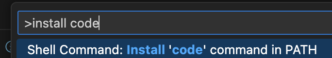

# MacOs Setup

Everytime I get a new Mac, or a collegue starts, there are some fundamental tools and hints I like to share in order to make the setup process seemless.

## Applications

These are some of the tools and apps that are recommended:

0. [Xcode](https://developer.apple.com/xcode/) Tools

Ensure you have a proper compilation toolchain
```
xcode-select --install
```

1. [iTerm](https://www.iterm2.com/)

Most developers spend their time on the console / terminal.  MacOs already offers a default Terminal, however I personally find iTerm more prowerful.

2. [sdkman.io](https://sdkman.io/install)

Excellent for installing Java (and easily managing the different versions) - plus many other SDKs like gradle, groovy, maven etc.  For example:

```
sdk install gradle
sdk install java 8.0.282-zulu
sdk install java 11.0.9-amzn
```

3. [Homebrew](https://brew.sh/)

The missing package manager for macOS.  Excellent for installing awscli, maven, nvm (and managing different versions of node), etc.

For Node apps or ReactJS apps:
```
brew ls --versions nvm && brew upgrade nvm || brew install nvm
nvm list
nvm install v18.12.1
nvm alias default v18.12.1
nvm use default
```

Note: Check AWS supports runtime [versions|https://docs.aws.amazon.com/lambda/latest/dg/lambda-runtimes.html] in order to match.

Others:
```
brew install awscli
brew install maven
brew install golang
```

4. [Atom](https://atom.io/)

Atom is a very lightweight text editor, that many have used for coding.  Today, I use Visual Code and IntelliJ for 90% of my code development, but there are many times I need a quick lihght weight text editor to just write some notes, or remove some formatting.

5. [Visual Studio Code](https://code.visualstudio.com/)

Great for web development, front end, ReactJS and GoLang to name a few.

6. [IntelliJ](https://www.jetbrains.com/idea/)

Great for Java, Groovy, Kotlin and Golang code bases.

Use Golang plugin https://plugins.jetbrains.com/plugin/9568-go

7. Enable Developer Mode using XCode

This assists in the debugger not asking for admin privilages everytime you attempt to run Delve or other debuggers.

```
sudo /usr/sbin/DevToolsSecurity -enable
```

## Aliases

Edit your `~/.zshrc` file and add some good old aliases:

`vi ~/.zshrc`

and add these at the top:

```
alias ll='ls -la'
alias h=history
alias dkrm='docker rm $(docker ps -aq)'
alias dkstop='docker stop $(docker ps -aq)'
alias dkdeleteimages='docker rmi -f $(docker images -a -q)'
alias dkclean='docker stop $(docker ps -aq) && docker rm $(docker ps -aq)'
```

## Add Git/branch prompt

Avoid accidently working in the wrong directory, or pushing the wrong branch. Setup your prompt to highlight the path you are in, and the git branch (if any).

The following gives you a prompt like:

```~/dev/github.com/andrewbruno/macos-setup main $```

Edit your `~/.zshrc` and add:

```
# Function to show Git branch if in a Git repo
parse_git_branch() {
  git rev-parse --abbrev-ref HEAD 2>/dev/null
}

# Custom prompt
export PS1="%F{green}%~%f %F{yellow}$(parse_git_branch)%f $ "
```

## Add support for Makefile command complete

Edit your `~/.zshrc` and add:

```
zstyle ':completion:*:*:make:*' tag-order 'targets'
autoload -U compinit && compinit
```

## Add ssh command complete

Add to your to your `~/.zshrc`:

```
_ssh()
{
    local cur prev opts
    COMPREPLY=()
    cur="${COMP_WORDS[COMP_CWORD]}"
    prev="${COMP_WORDS[COMP_CWORD-1]}"
    opts=$(grep '^Host' ~/.ssh/config | awk '{print $2}')
    COMPREPLY=( $(compgen -W "$opts" -- ${cur}) )
    return 0
}
complete -F _ssh ssh
```

In your .ssh/config file add mappings:

```
Host mars-prd
 Hostname mars.prd.universe
 IdentityFile ~/.ssh/id_rsa
 ForwardAgent yes

Host 10.*
  IdentityFile ~/.ssh/id_rsa
  ProxyCommand ssh -tW %h:%p mars-prd
```

## Visual Studio

Download from https://code.visualstudio.com/

Add `code .` shotcut to commnd prompt CLI

### 1. **Install VS Code Command Line Tool**:
First, ensure that the command-line tool for VS Code is installed. Open VS Code, then:

- Press `Cmd` + `Shift` + `P` to open the Command Palette.
- Type `Shell Command: Install 'code' command in PATH` and select it from the dropdown.



This step will add `code` to your system's `PATH`, allowing you to use the `code` command from the terminal.

### 2. **Restart Your Terminal**:
After adding the `code` command, restart your terminal for the changes to take effect.

### 3. **Verify the Installation**:
To verify that the `code` command is now available, run the following in your terminal:

```bash
code --version
```

If you see the version of VS Code, it means the command is successfully added to your `PATH`.

### 4. **Use `code .` to Open the Current Directory**:
Now you can open VS Code from any directory by typing:

```bash
code .
```
